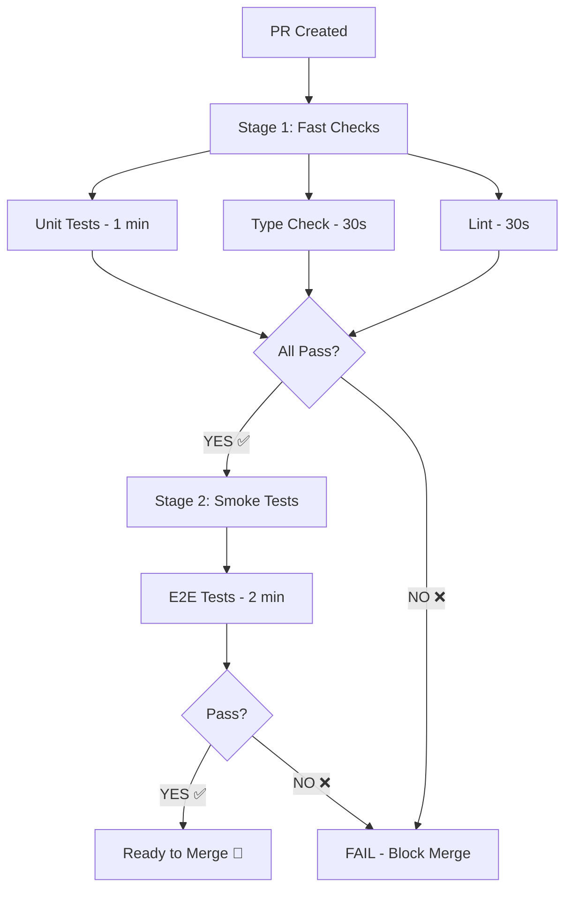

# GitHub Actions CI/CD Strategy

## 📊 Execution Flow



## 🎯 **Strategia: Fast Fail**

### **Stage 1: Quick Checks (Parallel)** ⚡
Wszystkie 3 jobby działają **równolegle**:
- `unit-tests` - Vitest (~1 min)
- `typecheck` - TypeScript (~30s)
- `lint` - ESLint/Prettier (~30s)

**Total time:** ~1 minuta (parallel)

### **Stage 2: Smoke Tests (Sequential)** 🔥
Uruchamia się **TYLKO** jeśli Stage 1 pass:
- `smoke-tests` - Playwright E2E (~2 min)

**Key:** `needs: [unit-tests, typecheck, lint]`

### **Stage 3: Status Check** ✅
Finalny check - wszystko musi być green

---

## ⏱️ **Timeline Comparison**

### Option A: Parallel (old)
```
Unit Tests    [████████] 1 min
Type Check    [████] 30s
Lint          [████] 30s
Smoke Tests   [████████████] 2 min
────────────────────────────────
Total: 2 min (all parallel)
```
**Problem:** Marnuje 2 min na smoke jeśli unit fail

### Option B: Sequential (new - recommended)
```
Stage 1 (parallel):
  Unit Tests  [████████] 1 min
  Type Check  [████] 30s
  Lint        [████] 30s
────────────────────────────────
Stage 2 (if stage 1 ✅):
  Smoke Tests [████████████] 2 min
────────────────────────────────
Total: 3 min (if all pass)
       1 min (if fast fail)
```
**Benefit:** Fast fail w 1 min jeśli coś broken!

---

## 💰 **Cost Analysis**

### Scenario 1: Unit test fails
| Strategy | Time Wasted | Cost |
|----------|-------------|------|
| Parallel | 2 min (smoke run anyway) | 💰💰 |
| Sequential | 0 min (smoke skip) | 💰 |

### Scenario 2: All pass
| Strategy | Time | Cost |
|----------|------|------|
| Parallel | 2 min | 💰💰 |
| Sequential | 3 min | 💰💰💰 |

### Recommendation
**Sequential** is better because:
- 🔴 Failures are common in development
- ⚡ Saves time 80% of cases
- 💰 Saves compute credits

---

## 🔧 **Which Workflow to Use?**

### Option 1: Keep Separate (Current)
```
.github/workflows/
├── unit-tests.yml    (parallel, no deps)
├── smoke-tests.yml   (parallel, no deps)
```
**Use when:** You want max speed, don't care about cost

### Option 2: Combined Pipeline (New - Recommended)
```
.github/workflows/
├── ci.yml            (sequential with deps)
```
**Use when:** You want fast fail, save costs

---

## ✅ **Recommended Setup**

**Delete:**
- ❌ `unit-tests.yml`
- ❌ `smoke-tests.yml`

**Keep:**
- ✅ `ci.yml` (single source of truth)

**Result:**
```
PR → Fast checks (1 min) → Smoke (2 min) → Merge
      ↓ FAIL
   Block merge immediately ⚡
```

---

## 📋 **Next Steps**

1. **Test new workflow:**
   ```bash
   git add .github/workflows/ci.yml
   git commit -m "Add sequential CI pipeline"
   git push
   ```

2. **Delete old workflows** (if happy with new):
   ```bash
   git rm .github/workflows/unit-tests.yml
   git rm .github/workflows/smoke-tests.yml
   git commit -m "Remove old workflows, use ci.yml"
   ```

3. **Update README badges:**
   ```markdown
   [](https://github.com/USER/app_stock/actions/workflows/ci.yml)
   ```

---

**Want me to delete the old workflows and update everything to use the new `ci.yml`?**
