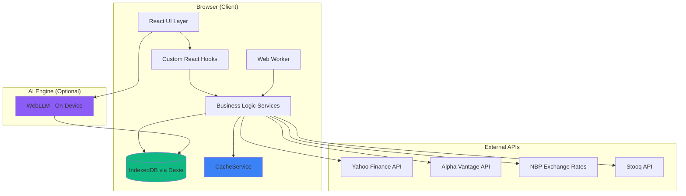
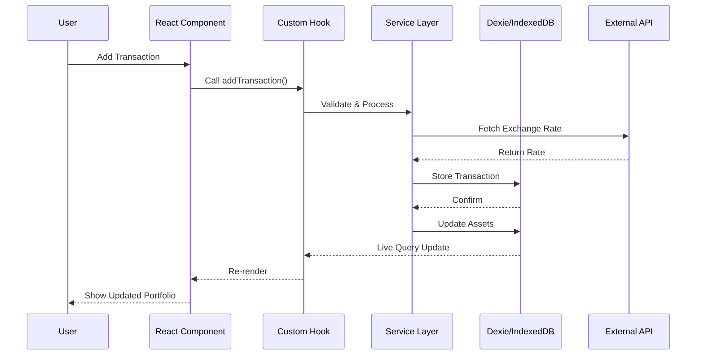
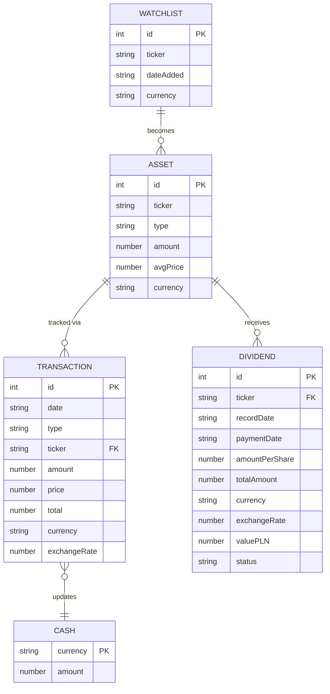
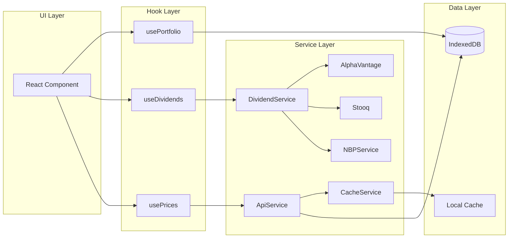
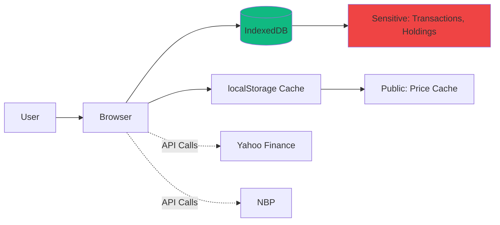

# StockTracker - Complete Technical Documentation

**Version:** 1.0.0  
**Last Updated:** 2026-01-04  
**Type:** Local-First Portfolio Management Web Application

---

## Table of Contents

1. [Executive Summary](#executive-summary)
2. [Business Requirements](#business-requirements)
3. [System Architecture](#system-architecture)
4. [Technical Stack](#technical-stack)
5. [Data Models & Database Schema](#data-models--database-schema)
6. [API & Services](#api--services)
7. [Features & Modules](#features--modules)
8. [Development & Deployment](#development--deployment)
9. [Testing Strategy](#testing-strategy)
10. [Security & Privacy](#security--privacy)

---

## Executive Summary

### What is StockTracker?

StockTracker is a **privacy-focused, local-first portfolio management application** designed for individual investors tracking stocks, ETFs, cryptocurrencies, and dividends. All data is stored locally in the browser using IndexedDB, ensuring complete privacy and offline functionality.

### Key Characteristics

- **Local-First Architecture** - All data stored in browser (IndexedDB via Dexie)
- **Zero Backend** - No server, no cloud, complete privacy
- **Multi-Currency** - PLN, USD, EUR, GBP, JPY, CHF, CNY support
- **Real-Time Data** - Integration with Yahoo Finance, Alpha Vantage, Stooq APIs
- **AI-Powered** - Optional on-device LLM assistant (WebLLM)
- **WebGPU Charts** - High-performance portfolio visualization

---

## Business Requirements

### Functional Requirements

#### FR-1: Portfolio Management
- **FR-1.1** User can add/edit/delete stock/ETF positions
- **FR-1.2** User can record buy/sell transactions
- **FR-1.3** User can manage cash deposits/withdrawals in multiple currencies
- **FR-1.4** System calculates average purchase price automatically
- **FR-1.5** System tracks total portfolio value with currency conversion

#### FR-2: Transaction Tracking
- **FR-2.1** User can view chronological transaction history
- **FR-2.2** Transactions support multiple currencies with exchange rates
- **FR-2.3** System stores historical exchange rates (NBP API)
- **FR-2.4** User can filter/search transactions

#### FR-3: Dividend Management
- **FR-3.1** System automatically fetches dividend data from APIs
- **FR-3.2** System calculates dividend amounts based on ownership on record date
- **FR-3.3** User can view YTD dividend income
- **FR-3.4** User can see upcoming dividends (60-day forecast)
- **FR-3.5** System calculates Yield on Cost (YoC)

#### FR-4: Data Visualization
- **FR-4.1** Dashboard shows portfolio breakdown by asset/currency
- **FR-4.2** WebGPU-powered price charts (1D, 1W, 1M, 3M, 1Y, MAX)
- **FR-4.3** Real-time profit/loss calculations
- **FR-4.4** Portfolio performance over time

#### FR-5: AI Assistant (Optional)
- **FR-5.1** On-device LLM for portfolio analysis
- **FR-5.2** User can chat with AI about portfolio data
- **FR-5.3** AI can generate charts from natural language queries
- **FR-5.4** Multiple model options (Qwen, Gemma, Llama, Mistral)

#### FR-6: Data Management
- **FR-6.1** User can export all data to JSON
- **FR-6.2** User can import data from JSON backup
- **FR-6.3** User can reset/clear all data

### Non-Functional Requirements

#### NFR-1: Performance
- **NFR-1.1** Initial page load < 2 seconds
- **NFR-1.2** Chart rendering < 100ms (WebGPU)
- **NFR-1.3** Database queries < 50ms
- **NFR-1.4** Support for 10,000+ transactions

#### NFR-2: Security & Privacy
- **NFR-2.1** No data leaves user's device (except API calls for prices)
- **NFR-2.2** No user accounts, no authentication, no tracking
- **NFR-2.3** All data stored in browser IndexedDB

#### NFR-3: Usability
- **NFR-3.1** Responsive design (desktop, tablet, mobile)
- **NFR-3.2** Dark theme optimized for readability
- **NFR-3.3** Polish UI language

#### NFR-4: Reliability
- **NFR-4.1** Works offline (except price/dividend updates)
- **NFR-4.2** Data persists across browser sessions
- **NFR-4.3** Graceful API failure handling

---

## System Architecture

### High-Level Architecture



### Layer Architecture

| Layer | Responsibility | Technologies |
|-------|---------------|--------------|
| **Presentation** | UI Components, Routing | React 19, React Router, Tailwind CSS |
| **Application** | Business Logic, State Management | Custom Hooks, Context API |
| **Domain** | Services, Data Processing | TypeScript Classes, Utilities |
| **Data Access** | Database Operations | Dexie.js (IndexedDB wrapper) |
| **External** | API Integrations | Fetch API, Axios-like services |

### Data Flow Diagram



---

## Technical Stack

### Core Technologies

| Technology | Version | Purpose |
|------------|---------|---------|
| **React** | 19.2.0 | UI Framework |
| **TypeScript** | 5.9.3 | Type Safety |
| **Vite** | 7.2.4 | Build Tool & Dev Server |
| **Dexie.js** | 4.2.1 | IndexedDB Wrapper |
| **Tailwind CSS** | 4.1.18 | Styling Framework |
| **React Router** | 7.11.0 | Client-Side Routing |

### Key Libraries

| Library | Purpose |
|---------|---------|
| **@mlc-ai/web-llm** | On-device AI models (WebLLM) |
| **@tanstack/react-virtual** | Virtualized lists for performance |
| **lucide-react** | Icon library |
| **sonner** | Toast notifications |
| **cheerio** | HTML parsing (for web scraping) |
| **clsx / tailwind-merge** | Utility for className management |

### Development Tools

| Tool | Purpose |
|------|---------|
| **ESLint** | Code linting |
| **Prettier** | Code formatting |
| **Vitest** | Unit testing |
| **TypeScript** | Static type checking |

### External APIs

| API | Purpose | Fallback |
|-----|---------|----------|
| **Yahoo Finance** | Stock prices, historical data | Alpha Vantage |
| **Alpha Vantage** | Stock prices, dividends | Yahoo Finance |
| **Stooq** | Polish stocks (.WA) | Yahoo Finance |
| **NBP API** | Historical exchange rates PLN | Fixed rate 1.0 |

---

## Data Models & Database Schema

### Database: StockTrackerDB (IndexedDB)

**Version:** 6 (with compound indexes for performance)

### Tables & Schema

#### 1. `assets` - Current Holdings

```typescript
interface Asset {
  id?: number;              // Auto-increment primary key
  ticker: string;           // Stock symbol (e.g., "AAPL")
  type: AssetType;         // 'stock' | 'etf' | 'crypto' | 'commodity'
  amount: number;          // Quantity owned
  avgPrice: number;        // Average purchase price
  currency?: CurrencyCode; // Trading currency
}
```

**Indexes:**
- `++id` (primary key)
- `ticker`, `type`, `amount`, `avgPrice`, `currency`

**Example Data:**
```json
{
  "id": 1,
  "ticker": "AAPL",
  "type": "stock",
  "amount": 10,
  "avgPrice": 150.50,
  "currency": "USD"
}
```

---

#### 2. `transactions` - Transaction History

```typescript
interface Transaction {
  id?: number;
  date: string;              // ISO format: "2024-01-15"
  type: TransactionType;     // 'buy' | 'sell' | 'deposit' | 'withdraw'
  ticker?: string;           // Undefined for cash transactions
  amount: number;            // Shares for trades, cash for deposits
  price?: number;            // Price per share
  total: number;             // Total transaction value
  currency?: CurrencyCode;
  exchangeRate?: number;     // Exchange rate to PLN
}
```

**Indexes:**
- `++id` (primary key)
- `date`, `type`, `ticker`, `[ticker+date]`, `[ticker+type]`

**Example Data:**
```json
{
  "id": 42,
  "date": "2024-01-15",
  "type": "buy",
  "ticker": "TSLA",
  "amount": 5,
  "price": 250.00,
  "total": 1250.00,
  "currency": "USD",
  "exchangeRate": 4.05
}
```

---

#### 3. `cash` - Cash Balances by Currency

```typescript
interface Cash {
  currency: CurrencyCode;  // Primary key
  amount: number;
}
```

**Indexes:**
- `currency` (primary key)
- `amount`

**Example Data:**
```json
{
  "currency": "PLN",
  "amount": 5000.00
}
```

---

#### 4. `dividends` - Dividend History

```typescript
interface Dividend {
  id?: number;
  ticker: string;
  recordDate: string;        // Ex-dividend date
  paymentDate: string;       // Payment date
  amountPerShare: number;
  totalAmount?: number;      // Calculated
  currency: CurrencyCode;
  exchangeRate?: number;
  valuePLN?: number;         // Calculated
  sharesOwned?: number;      // Shares owned on record date
  status: 'upcoming' | 'paid' | 'expected' | 'received';
}
```

**Indexes:**
- `++id` (primary key)
- `ticker`, `recordDate`, `[ticker+recordDate]`, `paymentDate`, `status`, `[status+paymentDate]`

---

#### 5. `watchlist` - Stocks to Watch

```typescript
interface WatchlistItem {
  id?: number;
  ticker: string;
  dateAdded: string;
  currency?: CurrencyCode;
}
```

**Indexes:**
- `++id` (primary key)
- `ticker`, `dateAdded`, `currency`

---

### Entity Relationship Diagram



---

## API & Services

### Service Architecture



### Core Services

#### 1. **ApiService** ([ApiService.ts](/src/lib/ApiService.ts))

**Purpose:** Fetch stock prices and historical data from Yahoo Finance

**Key Methods:**
- `fetchStockPrice(ticker)` - Get current price
- `fetchHistoricalData(ticker, interval)` - Get price history
- `fetchDividends(ticker)` - Get dividend history

**Caching:** Aggressive caching via CacheService (30min for prices, 24h for historical)

---

#### 2. **DividendService** ([DividendService.ts](/src/lib/DividendService.ts))

**Purpose:** Manage dividend data with multi-source fallback

**Key Methods:**
- `syncDividendsFromAPI()` - Auto-sync dividends (once per 24h)
- `calculateReceivedDividends()` - Calculate based on transaction history
- `calculateUpcomingDividends()` - Forecast next 60 days
- `calculateYieldOnCost()` - YoC metric

**API Fallback Chain:**
1. Alpha Vantage (primary)
2. Yahoo Finance (fallback)
3. Stooq (Polish stocks .WA)

**Smart Sync Logic:**
```typescript
// Triggers if:
// 1. Dividend table is empty OR
// 2. >24h since last sync
const shouldSync = !lastSync || (now - lastSync) > 24h;
```

---

#### 3. **NBPService** ([NBPService.ts](/src/lib/NBPService.ts))

**Purpose:** Fetch Polish exchange rates (PLN base)

**Key Methods:**
- `getHistoricalRate(currency, date)` - Get exchange rate for specific date
- `getCurrentRate(currency)` - Get latest rate

**Caching:** Permanent caching (exchange rates are immutable)

---

#### 4. **CacheService** ([CacheService.ts](/src/lib/CacheService.ts))

**Purpose:** Local storage caching with TTL (Time To Live)

**Key Methods:**
- `get(key)` - Retrieve cached data
- `set(key, data, ttl)` - Store with expiration
- `invalidate(pattern)` - Clear matching cache entries

**Cache Strategy:**

| Data Type | TTL | Storage |
|-----------|-----|---------|
| Stock Prices | 30 minutes | localStorage |
| Historical Data | 24 hours | localStorage |
| Dividend Data | Permanent | IndexedDB |
| Exchange Rates | Permanent | IndexedDB |

---

#### 5. **AlphaVantageService** ([AlphaVantageService.ts](/src/lib/AlphaVantageService.ts))

**Purpose:** Fetch stock data from Alpha Vantage API

**Key Methods:**
- `fetchDividends(ticker)` - Get dividend history
- `fetchStockPrice(ticker)` - Get current price

**API Key:** Required (set in `.env`)

---

#### 6. **StooqService** ([StooqService.ts](/src/lib/StooqService.ts))

**Purpose:** Web scraping Polish stocks from Stooq.pl

**Key Methods:**
- `fetchDividends(ticker)` - Scrape dividend data for .WA stocks

**Note:** Uses Cheerio for HTML parsing

---

### Custom React Hooks

#### 1. **usePortfolio** ([usePortfolio.ts](/src/hooks/usePortfolio.ts))

**Purpose:** Central hook for portfolio state and calculations

**Returns:**
```typescript
{
  assets: Asset[],                    // Current holdings
  cashBalances: Cash[],               // Cash by currency
  totalValuePLN: number,              // Total portfolio value
  totalInvestedPLN: number,           // Cost basis
  totalProfitLoss: number,            // P/L
  currencyBreakdown: object,          // Value by currency
  addTransaction: (tx) => Promise,
  deleteTransaction: (id) => Promise
}
```

---

#### 2. **useDividends** ([useDividends.ts](/src/hooks/useDividends.ts))

**Purpose:** Dividend data and statistics

**Returns:**
```typescript
{
  ytdTotal: number,                   // Year-to-date total
  upcoming60Days: number,             // Forecast
  yieldOnCost: number,                // YoC %
  monthlyAverage: number,             // Monthly avg (12 months)
  calendar: Dividend[],               // Upcoming dividends
  received: Dividend[],               // Historical
  syncDividendsManually: () => Promise
}
```

---

#### 3. **usePrices** ([usePrices.ts](/src/hooks/usePrices.ts))

**Purpose:** Real-time stock price fetching

**Returns:**
```typescript
{
  prices: Map<ticker, price>,
  loading: boolean,
  error: string | null,
  refetch: () => Promise
}
```

---

## Features & Modules

### Module Structure

```
src/
├── pages/              # Main application pages
│   ├── Dashboard.tsx   # Portfolio overview
│   ├── Portfolio.tsx   # Holdings & watchlist
│   ├── Transactions.tsx # Transaction history
│   ├── Dividends.tsx   # Dividend tracking
│   ├── AI.tsx          # AI assistant (optional)
│   ├── Settings.tsx    # App settings
│   └── Simulator.tsx   # Portfolio simulator
├── components/         # Reusable UI components
├── hooks/             # Custom React hooks
├── lib/               # Business logic services
├── context/           # React Context providers
├── utils/             # Utility functions
├── types/             # TypeScript type definitions
├── db/                # Database configuration
└── workers/           # Web Workers
```

### Feature Breakdown

#### Dashboard Page
- **Summary Cards:** Total Value, P/L, YTD Dividends, Cash Balance
- **Asset Allocation:** Pie chart by ticker
- **Currency Breakdown:** Portfolio value by currency
- **Quick Actions:** Add transaction, view dividends

#### Portfolio Page
- **Holdings Table:** Ticker, shares, avg price, current price, P/L
- **Watchlist:** Track stocks without owning
- **Price Charts:** WebGPU-powered historical charts
- **Multi-timeframe:** 1D, 1W, 1M, 3M, 1Y, MAX

#### Transactions Page
- **Chronological History:** All transactions sorted by date (reverse chronological)
- **Read-Only View:** Immutable transaction history for audit purposes
- **Detailed Information:** Date, type, ticker, quantity, price, exchange rate, PLN value
- **Transaction Types:** Buy, Sell, Deposit, Withdraw

#### Dividends Page
- **Statistics:** YTD total, YoC%, monthly average
- **Calendar:** Upcoming dividends (60 days)
- **History:** All received dividends
- **Auto-Sync:** Smart sync every 24h

#### AI Page (Optional)
- **Chat Interface:** Natural language queries
- **Portfolio Analysis:** AI-powered insights
- **Chart Generation:** Create charts from text
- **Model Selection:** Multiple LLM options

#### Settings Page
- **AI Model:** Select LLM (if enabled)
- **Data Management:** Export, import, reset

---

## Development & Deployment

### Project Setup

```bash
# Clone repository
git clone <repo-url>
cd app_stock

# Install dependencies
npm install

# Environment setup
cp .env.example .env
# Add API keys to .env

# Development server
npm run dev           # With AI (downloads model)
npm run dev:nolmm     # Without AI (faster start)

# Build for production
npm run build

# Preview production build
npm run preview
```

### Environment Variables

| Variable | Purpose | Required |
|----------|---------|----------|
| `VITE_ALPHA_VANTAGE_API_KEY` | Alpha Vantage API | Optional |
| `VITE_DISABLE_AI` | Disable AI features | Optional |

### NPM Scripts

| Script | Purpose |
|--------|---------|
| `npm run dev` | Start dev server with AI |
| `npm run dev:nolmm` | Start dev server without AI |
| `npm run build` | Production build |
| `npm run preview` | Preview production build |
| `npm run test` | Run unit tests (Vitest) |
| `npm run test:ui` | Vitest UI |
| `npm run test:coverage` | Coverage report |
| `npm run lint` | ESLint check |
| `npm run format` | Prettier format |
| `npm run typecheck` | TypeScript check |

### Build Output

```
dist/
├── index.html           # Entry point
├── assets/
│   ├── index-[hash].js  # Main bundle
│   ├── index-[hash].css # Styles
│   └── ...              # Chunked assets
└── [model files]        # LLM models (if enabled)
```

---

## Testing Strategy

### Unit Tests (Vitest)

**Coverage:** 80%+ target

**Test Files:**
```
src/
├── lib/
│   ├── DividendService.test.js
│   ├── CacheService.test.js
│   └── ...
├── utils/
│   ├── formatters.test.js
│   ├── calculations.test.js
│   └── validators.test.js
└── hooks/
    └── [hooks tests]
```

**Run Tests:**
```bash
npm run test              # Run all tests
npm run test:ui           # Interactive UI
npm run test:coverage     # Coverage report
```

### Example Test

```javascript
describe('DividendService', () => {
  it('should calculate YTD total', async () => {
    const total = await dividendService.calculateYTDTotal();
    expect(total).toBeGreaterThanOrEqual(0);
  });
});
```

---

## Security & Privacy

### Privacy Principles

| Principle | Implementation |
|-----------|----------------|
| **Local-First** | All data in IndexedDB, never sent to server |
| **No Tracking** | Zero analytics, no cookies |
| **No Accounts** | No registration, no auth |
| **API Only** | External calls only for prices/dividends |

### Data Storage



### Security Best Practices

✅ **Implemented:**
- Client-side validation for all inputs
- Type safety with TypeScript
- Error boundaries for crash protection
- Sanitized user inputs

❌ **Not Needed (No Backend):**
- Authentication
- Authorization
- SQL injection protection
- XSS protection (React escapes by default)

---

## Appendix

### Glossary

| Term | Definition |
|------|------------|
| **YoC** | Yield on Cost - dividend yield based on original purchase price |
| **YTD** | Year to Date |
| **P/L** | Profit/Loss |
| **DPS** | Dividend Per Share |
| **NBP** | Narodowy Bank Polski (Polish Central Bank) |
| **LLM** | Large Language Model |
| **WebLLM** | Browser-based LLM runtime |

### Contact & Support

**Developer:** Divi  
**Repository:** (Your repo URL)  
**Issues:** (Your issues URL)

---

**Document Version:** 1.0.0  
**Last Updated:** 2026-01-04
