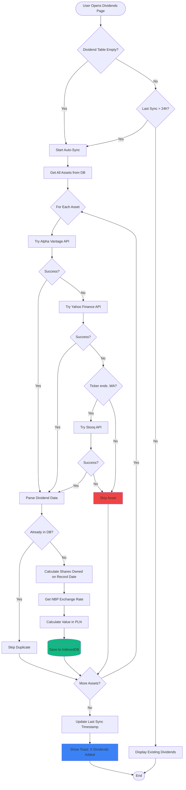
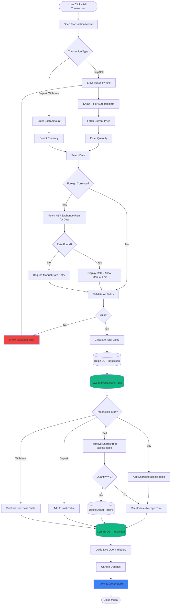
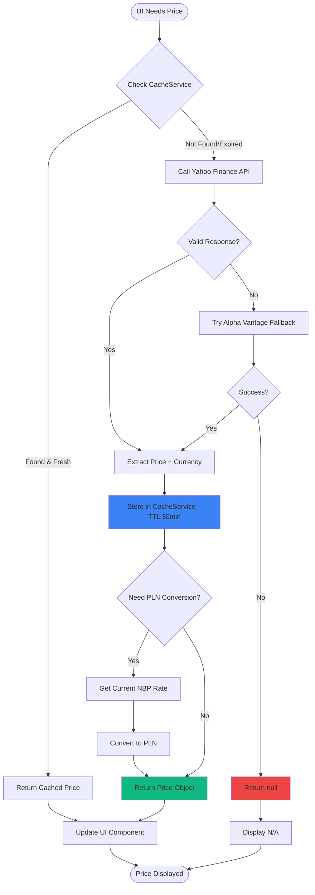
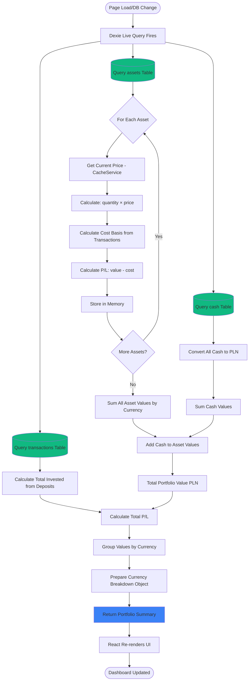

# Process Flow Diagrams

This document contains detailed flowcharts showing how key processes work in StockTracker.

---

## Table of Contents

1. [Dividend Synchronization](#dividend-synchronization)
2. [Transaction Processing](#transaction-processing)
3. [Price Fetching](#price-fetching)
4. [Portfolio Calculation](#portfolio-calculation)

---

## Dividend Synchronization

**Triggered by:** Page load if empty table OR >24h since last sync, or manual refresh button

**Key Decision Points:**
- **Auto-Sync Trigger:** Empty table OR >24h since last sync
- **API Fallback:** Alpha Vantage → Yahoo → Stooq (for .WA)
- **Duplicate Check:** By `ticker + recordDate` to prevent duplication
- **Shares Calculation:** Queries `transactions` table for ownership on record date

**Implementation:** `src/lib/DividendService.ts :: syncDividendsFromAPI()`

---

## Transaction Processing

**Triggered by:** User clicking "Add Transaction" button

**Critical Steps:**
- **NBP Rate Fetching:** Automatic for foreign currencies with manual override option
- **Average Price Calculation:** Weighted by quantity for buys
- **Asset Cleanup:** Automatically removes asset when all shares sold
- **Live Query:** Dexie triggers UI updates automatically when DB changes

**Implementation:** `src/hooks/usePortfolio.ts :: addTransaction()`

---

## Price Fetching

**Triggered by:** UI component needing current price (Dashboard, Portfolio, etc.)

**Performance Optimizations:**
- **Aggressive Caching:** 30min TTL to minimize API calls
- **Fallback Strategy:** Yahoo Finance primary, Alpha Vantage secondary
- **Bulk Fetching:** Multiple prices fetched concurrently
- **Error Handling:** Graceful degradation to "N/A" on failure

**Implementation:** `src/lib/ApiService.ts :: fetchStockPrice()`

---

## Portfolio Calculation

**Triggered by:** Any database change (via Dexie Live Query)

**Real-Time Updates:**
- **Dexie Live Query:** Automatically re-runs on any DB change
- **Currency Conversion:** All values normalized to PLN for totals
- **Breakdown:** Maintains original currencies for diversification view
- **Performance:** Calculations cached until next DB change

**Implementation:** `src/hooks/usePortfolio.ts :: useEffect + useLiveQuery`

---

## Quick Reference

| Process | Trigger | Primary Files | Key APIs |
|---------|---------|---------------|----------|
| **Dividend Sync** | Auto (24h) or Manual | `DividendService.ts`, `useDividends.ts` | Alpha Vantage, Yahoo, Stooq |
| **Add Transaction** | User action | `usePortfolio.ts`, `AddTransactionModal.tsx` | NBP (exchange rates) |
| **Price Fetch** | UI render | `ApiService.ts`, `usePrices.ts` | Yahoo Finance, Alpha Vantage |
| **Portfolio Calc** | DB change | `usePortfolio.ts` | None (local calculation) |

---

**Document Version:** 1.0.0  
**Last Updated:** 2026-01-04
