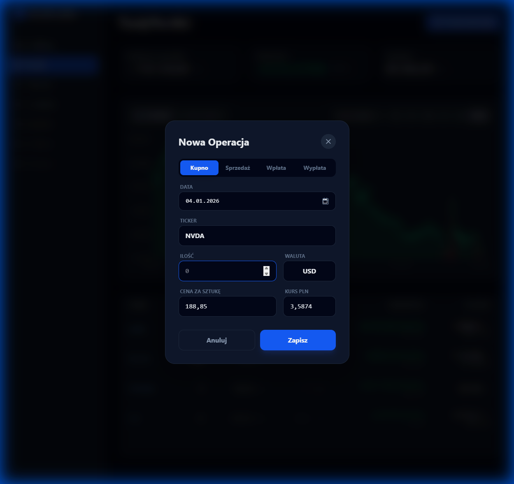
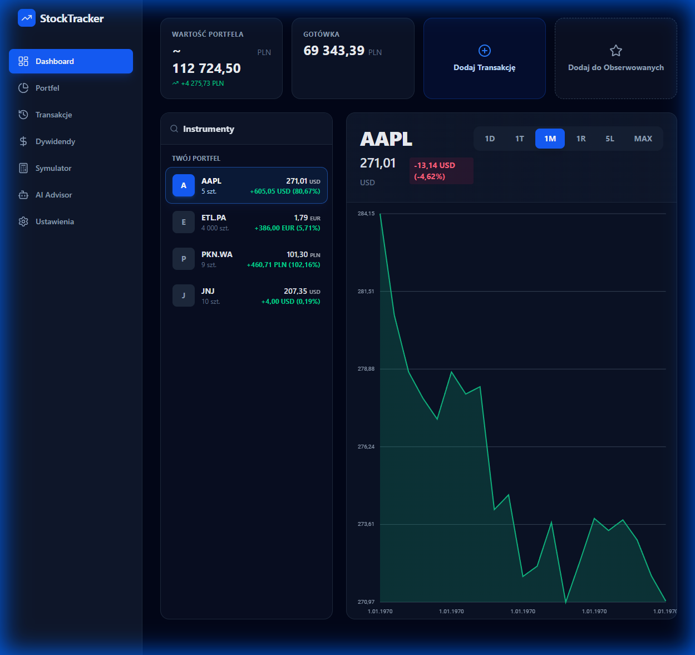
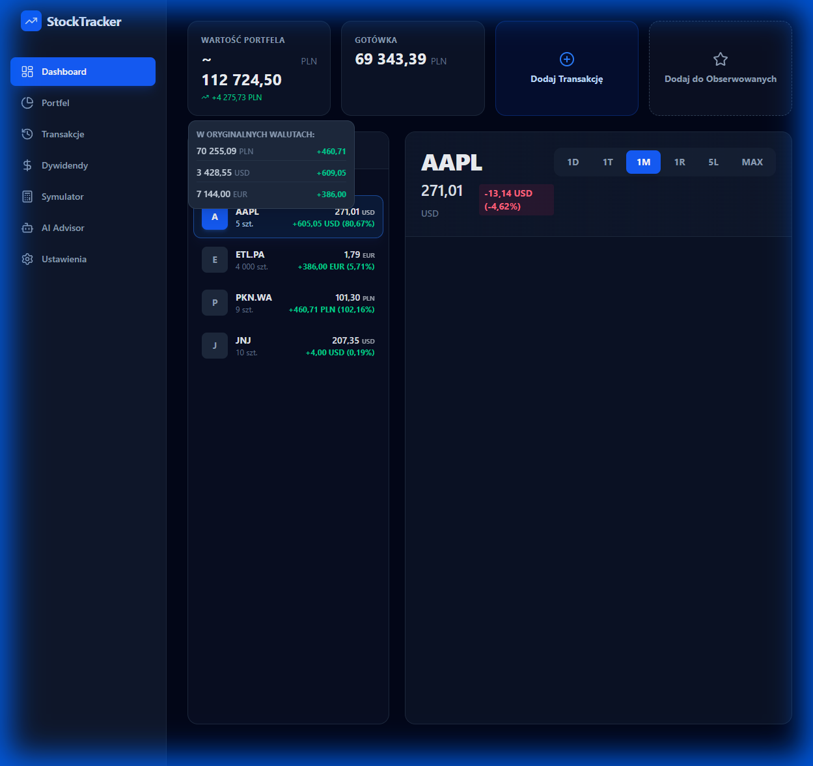
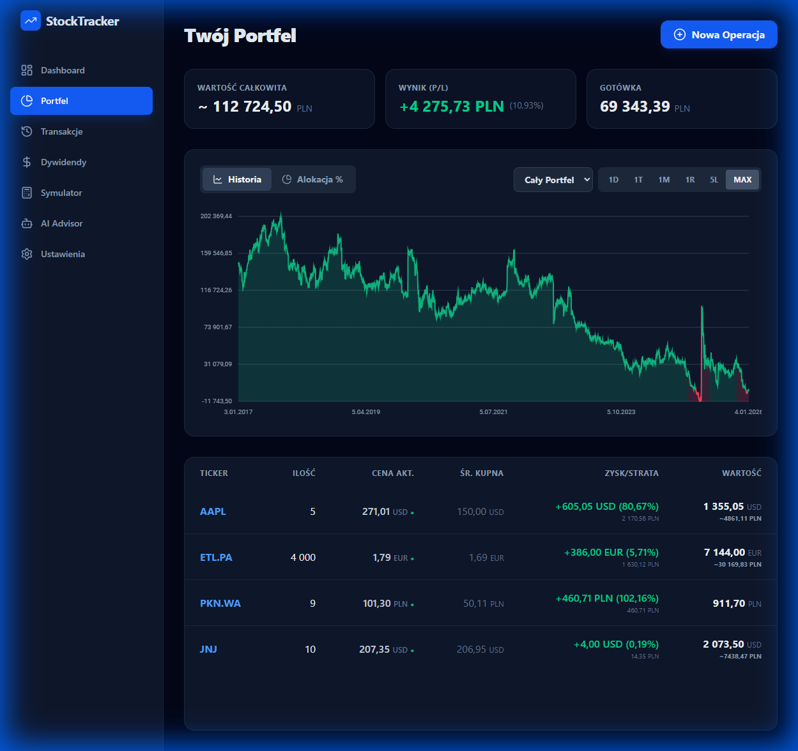
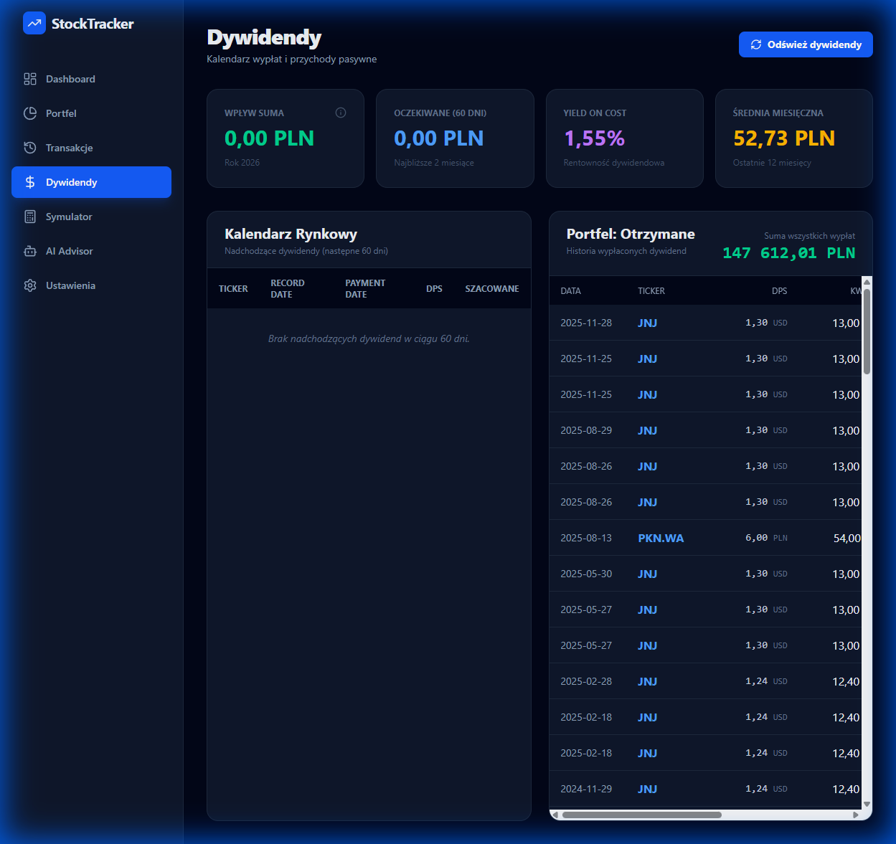
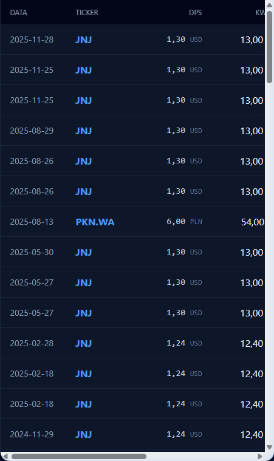
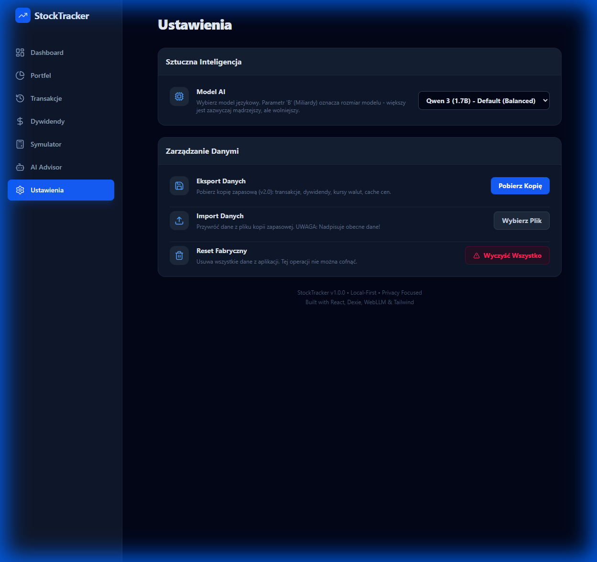

# StockTracker - Instrukcja Użytkownika

**Wersja:** 1.0.0  
**Data aktualizacji:** 2026-01-04

---

## Spis Treści

1. [Wprowadzenie](#wprowadzenie)
2. [Pierwsze Kroki](#pierwsze-kroki)
3. [Panel Dashboard](#panel-dashboard)
4. [Zarządzanie Portfelem](#zarządzanie-portfelem)
5. [Transakcje](#transakcje)
6. [Dywidendy](#dywidendy)
7. [Asystent AI (Opcjonalnie)](#asystent-ai-opcjonalnie)
8. [Ustawienia](#ustawienia)
9. [Import i Eksport Danych](#import-i-eksport-danych)
10. [Najczęściej Zadawane Pytania (FAQ)](#najczęściej-zadawane-pytania-faq)
11. [Rozwiązywanie Problemów](#rozwiązywanie-problemów)

---

## Wprowadzenie

### Czym jest StockTracker?

StockTracker to **darmowa aplikacja do zarządzania portfelem inwestycyjnym**, która działa bezpośrednio w Twojej przeglądarce. Wszystkie Twoje dane są przechowywane **lokalnie na Twoim komputerze** - nigdy nie trafiają na zewnętrzne serwery.

### Główne Funkcje

✅ **Śledzenie portfela akcji, ETF i kryptowalut**  
✅ **Automatyczne pobieranie cen w czasie rzeczywistym**  
✅ **Zarządzanie dywidendami z prognozą wypłat**  
✅ **Obsługa wielu walut** (PLN, USD, EUR, GBP, JPY, CHF, CNY)  
✅ **Wykresy historyczne** powered by WebGPU  
✅ **Asystent AI** do analizy portfela (opcjonalnie)  
✅ **100% prywatność** - brak kont, brak śledzenia

### Wymagania

- Przeglądarka: **Chrome 90+**, **Edge 90+**, **Firefox 88+**
- System: Windows, macOS, Linux
- Połączenie internetowe: **wymagane** do pobierania cen (aplikacja działa offline po pierwszym załadowaniu)

---

## Pierwsze Kroki

### Krok 1: Uruchomienie Aplikacji

1. Otwórz przeglądarkę internetową
2. Przejdź pod adres: `http://localhost:5173` (w trybie deweloperskim)
3. Aplikacja załaduje się automatycznie

> **💡 Wskazówka:** Dodaj zakładkę do ulubionych dla szybkiego dostępu!

---

### Krok 2: Dodanie Pierwszej Gotówki

Przed zakupem akcji musisz dodać gotówkę do swojego portfela.

**Jak to zrobić:**

1. Kliknij przycisk **"Dodaj Transakcję"** w prawym górnym rogu
2. Wybierz typ transakcji: **"Depozyt"**
3. Wprowadź kwotę (np. `10000`)
4. Wybierz walutę (np. `PLN`)
5. Wybierz datę depozytu
6. Kliknij **"Dodaj"**

```
┌─────────────────────────────────┐
│  Dodaj Transakcję               │
├─────────────────────────────────┤
│ Typ:      [Depozyt ▼]          │
│ Kwota:    [10000]               │
│ Waluta:   [PLN ▼]              │
│ Data:     [2024-01-04]          │
│                                 │
│         [Anuluj]  [Dodaj]      │
└─────────────────────────────────┘
```

**Rezultat:** Twoja gotówka pojawi się w sekcji "Gotówka" na Dashboard.

---

### Krok 3: Dodanie Pierwszej Akcji

**Np. zakup 10 akcji Apple:**

1. Kliknij **"Dodaj Transakcję"**
2. Wybierz typ: **"Kupno"**
3. Wprowadź ticker: **`AAPL`**
4. Ilość akcji: **`10`**
5. Cena za akcję: **`150.50`** (lub zostaw puste - aplikacja pobierze automatycznie)
6. Data transakcji: **`2024-01-04`**
7. Kliknij **"Dodaj"**

```
┌─────────────────────────────────┐
│  Dodaj Transakcję - Kupno       │
├─────────────────────────────────┤
│ Ticker:   [AAPL]                │
│ Ilość:    [10]                  │
│ Cena:     [150.50] USD          │
│ Data:     [2024-01-04]          │
│ Kurs NBP: [4.05] (auto)         │
│                                 │
│ Suma:     1505.00 USD           │
│ W PLN:    6095.25 PLN           │
│                                 │
│         [Anuluj]  [Dodaj]      │
└─────────────────────────────────┘
```

**Rezultat:** Akcje AAPL pojawią się w Twoim portfelu!



---

## Panel Dashboard

### Co Widzisz na Dashboard?

Dashboard to **główny ekran** aplikacji, który pokazuje podsumowanie Twojego portfela.



#### Sekcja 1: Karty Podsumowania

```
┌──────────────────┬──────────────────┬──────────────────┬──────────────────┐
│ Wartość Portfela │ Gotówka          │ [Add Transaction]│ [Add Watchlist]  │
│                  │                  │                  │                  │
│  50 000 PLN      │ 10 000 PLN      │  + Button        │  ⭐ Button      │
│  ↑ +11.11%       │  PLN + USD      │                  │                  │
└──────────────────┴──────────────────┴──────────────────┴──────────────────┘
```

**Co oznaczają:**

| Karta | Opis |
|-------|------|
| **Wartość Portfela** | Łączna wartość wszystkich Twoich akcji + gotówka (w PLN) |
| **Gotówka** | Dostępna gotówka we wszystkich walutach |

---

#### Sekcja 2: Alokacja Aktywów

**Wykres kołowy** pokazujący procentowy udział każdej akcji w Twoim portfelu.

```
     ┌─────────────────────────┐
     │   Alokacja Portfela     │
     ├─────────────────────────┤
     │                         │
     │        🥧               │
     │     AAPL 40%            │
     │     TSLA 30%            │
     │     MSFT 30%            │
     │                         │
     └─────────────────────────┘
```

**Jak to interpretować:**
- Większy kawałek = większy udział w portfelu
- Kolory pomagają odróżnić różne aktywa

---

#### Sekcja 3: Podział według Waluty

Pokazuje wartość portfela w podziale na waluty zainwestowanych aktywów.

> **💡 Wskazówka:** Najedź kursorem na "Wartość Portfela" aby zobaczyć szczegółowy podział!

**Tooltip pokazuje:**
```
W oryginalnych walutach:
──────────────────────────
12 500 USD     +1 250      ← Wartość + Zysk/Strata w USD
3 500 PLN      +350        ← Wartość + Zysk/Strata w PLN  
1 200 EUR      +120        ← Wartość + Zysk/Strata w EUR
```



---

## Zarządzanie Portfelem

### Strona Portfolio

Przejdź do: **Sidebar → Portfolio**

Na tej stronie widzisz:
1. **Tabela Posiadanych Aktywów** - co masz w portfelu
2. **Watchlist** - akcje które śledzisz (nie musisz ich posiadać)
3. **Wykresy Cenowe** - historia cen

---

### Tabela Aktywów



```
┌────────┬────────┬──────────┬─────────┬───────────┬─────────────┐
│ Ticker │ Ilość  │ Śr. Cena │ Cena    │ Wartość   │ Zysk/Strata │
├────────┼────────┼──────────┼─────────┼───────────┼─────────────┤
│ AAPL   │ 10     │ 150.50   │ 165.20  │ 1652.00   │ +147.00     │
│        │        │ USD      │ USD     │ USD       │ (+9.8%)     │
├────────┼────────┼──────────┼─────────┼───────────┼─────────────┤
│ TSLA   │ 5      │ 250.00   │ 245.00  │ 1225.00   │ -25.00      │
│        │        │ USD      │ USD     │ USD       │ (-2.0%)     │
└────────┴────────┴──────────┴─────────┴───────────┴─────────────┘
```

**Kolumny:**
- **Ticker** - Symbol akcji (np. AAPL = Apple)
- **Ilość** - Ile akcji posiadasz
- **Śr. Cena** - Średnia cena zakupu (Twoja cena bazowa)
- **Cena** - Aktualna cena rynkowa (odświeżana co 30 minut)
- **Wartość** - Obecna wartość: `Ilość × Cena`
- **Zysk/Strata** - Różnica między wartością a kosztem zakupu

---

### Wykresy Cenowe

**Kliknij na akcję** w tabeli, aby zobaczyć wykres.

Dostępne przedziały czasowe:
- **1D** - Ostatnie 24 godziny
- **1W** - Ostatni tydzień
- **1M** - Ostatni miesiąc
- **3M** - Ostatnie 3 miesiące
- **1Y** - Ostatni rok
- **MAX** - Cała dostępna historia

```
┌─────────────────────────────────────────────────────┐
│  AAPL - Apple Inc.                      165.20 USD  │
│  [1D] [1W] [1M] [3M] [1Y] [MAX]                    │
├─────────────────────────────────────────────────────┤
│                                             /\      │
│                                    /\      /  \     │
│                           /\      /  \    /    \    │
│                  /\      /  \    /    \  /      \   │
│         /\      /  \    /    \  /      \/        \  │
│   ─────/──\────/────\──/──────\/─────────────────── │
└─────────────────────────────────────────────────────┘
    1M      2M      3M      4M      5M      6M
```

> **💡 Wskazówka:** Wykresy używają WebGPU dla ultra-szybkiego renderowania!

---

### Watchlist - Lista Obserwowanych

**Co to jest Watchlist?**
Miejsce dla akcji, które chcesz śledzić, ale jeszcze nie kupiłeś.

**Jak dodać akcję do Watchlist:**
1. Przejdź do sekcji **"Watchlist"**
2. Kliknij **"+ Dodaj do Watchlist"**
3. Wpisz ticker (np. `NVDA`)
4. Wybierz walutę handlu
5. Kliknij **"Dodaj"**

**Rezultat:** Akcja pojawi się w liście z aktualną ceną!

---

## Transakcje

### Strona Transakcji

Przejdź do: **Sidebar → Transakcje**

Tutaj widzisz **całą historię** swoich transakcji, posortowaną chronologicznie.

---

### Typy Transakcji

| Typ | Ikona | Opis |
|-----|-------|------|
| **Kupno** | 📈 | Zakup akcji |
| **Sprzedaż** | 📉 | Sprzedaż akcji |
| **Depozyt** | 💰 | Wpłata gotówki |
| **Wypłata** | 💸 | Wypłata gotówki |

---

### Tabela Transakcji

```
┌────────────┬──────────┬────────┬────────┬─────────┬───────────┐
│ Data       │ Typ      │ Ticker │ Ilość  │ Cena    │ Suma      │
├────────────┼──────────┼────────┼────────┼─────────┼───────────┤
│ 2024-01-04 │ Kupno    │ AAPL   │ 10     │ 150.50  │ 1505.00   │
│            │          │        │        │ USD     │ USD       │
├────────────┼──────────┼────────┼────────┼─────────┼───────────┤
│ 2024-01-03 │ Depozyt  │ -      │ -      │ -       │ 10000.00  │
│            │          │        │        │         │ PLN       │
└────────────┴──────────┴────────┴────────┴─────────┴───────────┘
```

---

### Edycja/Usuwanie Transakcji

**Jak usunąć transakcję:**
1. Znajdź transakcję w tabeli
2. Kliknij ikonę **🗑️ (Trash)** po prawej stronie
3. Potwierdź usunięcie

> **⚠️ UWAGA:** Usunięcie transakcji **automatycznie zaktualizuje** Twoje aktywa i gotówkę!

**Przykład:**
- Usunięcie transakcji "Kupno 10 AAPL" → Usunie 10 akcji AAPL z portfela + zwróci gotówkę

---

### Kursy Walut

**Automatyczne pobieranie kursów:**
Aplikacja automatycznie pobiera historyczne kursy NBP dla transakcji w walutach obcych.

**Przykład:**
```
Kupujesz: 10 AAPL × 150.50 USD = 1505.00 USD
Kurs NBP (2024-01-04): 4.05 PLN/USD
W PLN: 1505.00 × 4.05 = 6095.25 PLN
```

> **💡 Wskazówka:** Możesz ręcznie edytować kurs przed dodaniem transakcji!

---

## Dywidendy

### Strona Dywidendy

Przejdź do: **Sidebar → Dywidendy**

Miejsce gdzie śledzisz **wszystkie dywidendy** - zarówno otrzymane, jak i oczekiwane.

---

### Co widzisz?



#### 1. Karty Statystyk

```
┌──────────────┬──────────────┬──────────────┬──────────────┐
│ Wpływ Suma   │ Oczekiwane   │ Yield on Cost│ Średnia/Mies │
│              │ (60 dni)     │              │              │
│  2 500 PLN   │  150 PLN    │  5.2%       │  208 PLN    │
│  Rok 2024    │  2 miesiące  │  Rentowność  │  12 miesięcy │
└──────────────┴──────────────┴──────────────┴──────────────┘
```

**Co oznaczają:**

| Statystyka | Opis |
|------------|------|
| **Wpływ Suma** | Suma wszystkich dywidend otrzymanych w 2024 roku |
| **Oczekiwane (60 dni)** | Szacowana suma dywidend w ciągu najbliższych 2 miesięcy |
| **Yield on Cost (YoC)** | Roczna stopa zwrotu z dywidend względem ceny zakupu |
| **Średnia/Miesiąc** | Średnia miesięczna dywidenda (ostatnie 12 miesięcy) |

---

#### 2. Kalendarz Rynkowy

Pokażuje **nadchodzące dywidendy** w ciągu najbliższych 60 dni.



```
┌────────┬─────────────┬──────────────┬─────────┬──────────────┐
│ Ticker │ Record Date │ Payment Date │ DPS     │ Szacowane    │
├────────┼─────────────┼──────────────┼─────────┼──────────────┤
│ AAPL   │ 2024-02-09  │ 2024-02-16   │ 0.24    │ ~9.72 PLN   │
│        │             │              │ USD     │              │
├────────┼─────────────┼──────────────┼─────────┼──────────────┤
│ MSFT   │ 2024-02-15  │ 2024-03-14   │ 0.68    │ ~13.60 PLN  │
│        │             │              │ USD     │              │
└────────┴─────────────┴──────────────┴─────────┴──────────────┘
```

**Kolumny:**
- **Record Date** - Data ustalenia prawa do dywidendy (musisz posiadać akcje przed tym dniem!)
- **Payment Date** - Data wypłaty
- **DPS** - Dividend Per Share (dywidenda na akcję)
- **Szacowane** - Przewidywana kwota do otrzymania (DPS × Twoje akcje)

---

#### 3. Historia Otrzymanych Dywidend

**Pełna tabela** wszystkich dywidend które otrzymałeś.

```
┌────────────┬────────┬─────────┬─────────┬─────────┬──────────┐
│ Data       │ Ticker │ DPS     │ Kwota   │ Kurs NBP│ PLN      │
├────────────┼────────┼─────────┼─────────┼─────────┼──────────┤
│ 2024-01-16 │ AAPL   │ 0.24    │ 2.40    │ 4.05    │ 9.72     │
│            │        │ USD     │ USD     │         │ PLN      │
└────────────┴────────┴─────────┴─────────┴─────────┴──────────┘
```

> **💡 Wskazówka:** W nagłówku sekcji "Portfel: Otrzymane" widzisz **sumę wszystkich wypłat**!

---

### Automatyczna Synchronizacja

**Jak działa:**
- Aplikacja **automatycznie** pobiera dane o dywidendach raz dziennie
- Wykorzystuje 3 źródła danych:
  1. Alpha Vantage (główne)
  2. Yahoo Finance (zapasowe)
  3. Stooq (polskie akcje .WA)

**Ręczna synchronizacja:**
Kliknij przycisk **"Odśwież dywidendy"** w prawym górnym rogu.

```
┌─────────────────────────────────┐
│ ✓ Zsynchronizowano: +5 dywidend │
└─────────────────────────────────┘
```

---

### Yield on Cost (YoC) - Co to jest?

**Definicja:** Procentowa stopa zwrotu z dywidend względem Twojej pierwotnej ceny zakupu.

**Wzór:**
```
YoC = (Roczne Dywidendy ÷ Koszt Zakupu) × 100%
```

**Przykład:**
```
Kupiłeś 100 akcji AAPL po 150 USD = 15,000 USD
Roczne dywidendy: 0.96 USD × 100 = 96 USD
YoC = (96 ÷ 15,000) × 100% = 0.64%
```

> **💡 Wskazówka:** YoC **nie zmienia się** wraz z ceną akcji - pokazuje rentowność względem Twojej inwestycji!

---

## Asystent AI (Opcjonalnie)

### Czym jest AI Assistant?

Lokalny asystent AI działający **bezpośrednio w przeglądarce** (bez wysyłania danych na serwer).

> **⚠️ UWAGA:** Funkcja AI jest **opcjonalna** i można ją wyłączyć w `.env` jeśli nie jest potrzebna.

---

### Jak Włączyć AI?

1. Upewnij się, że masz wystarczająco RAM (min. 4GB wolnego)
2. Uruchom: `npm run dev` (z AI) zamiast `npm run dev:nolmm`
3. Poczekaj na pobranie modelu (~1-2GB)
4. Przejdź do **Sidebar → AI**

---

### Jak Rozmawiać z AI?

**Przykładowe pytania:**

```
Użytkownik: "Pokaż wykres moich akcji AAPL"
AI: [Generuje wykres]

Użytkownik: "Jaka jest moja całkowita strata/zysk?"
AI: "Twój portfel ma wartość 50,000 PLN z zyskiem +5,000 PLN (+11.11%)"

Użytkownik: "Które akcje mają najlepszy YoC?"
AI: "Najlepszy YoC mają: MSFT (3.2%), AAPL (2.1%)"
```

---

### Wybór Modelu AI

W **Ustawieniach → Sztuczna Inteligencja** możesz wybrać model:

| Model | Rozmiar | Szybkość | Jakość |
|-------|---------|----------|--------|
| **Qwen 3 (0.6B)** | Mały | ⚡⚡⚡ | ⭐⭐ |
| **Qwen 3 (1.7B)** | Średni | ⚡⚡ | ⭐⭐⭐ (Domyślny) |
| **Qwen 3 (4B)** | Duży | ⚡ | ⭐⭐⭐⭐ |
| **Mistral 7B** | Bardzo duży | 🐌 | ⭐⭐⭐⭐⭐ |

> **💡 Wskazówka:** Jeśli AI jest wolne, wybierz mniejszy model!

---

## Ustawienia

### Strona Settings

Przejdź do: **Sidebar → Ustawienia**



---

### Dostępne Ustawienia

#### 1. Sztuczna Inteligencja

**Model AI** - Wybierz model językowy (jeśli AI jest włączone)

```
┌─────────────────────────────────┐
│ Model AI:                       │
│ [Qwen 3 (1.7B) - Default ▼]   │
└─────────────────────────────────┘
```

---

#### 2. Zarządzanie Danymi

**Eksport Danych**
- Pobierz kopię zapasową wszystkich danych w formacie JSON
- Zawiera: transakcje, dywidendy, kursy walut, cache cen

**Kliknij:** "Pobierz Kopię"

**Rezultat:** Pobierze plik `stocktracker-backup-YYYY-MM-DD.json`

---

**Import Danych**
- Przywróć dane z pliku kopii zapasowej
- ⚠️ **UWAGA:** Nadpisuje wszystkie obecne dane!

**Kliknij:** "Wybierz Plik" → wybierz `*.json` → potwierdź

---

**Reset Fabryczny**
- Usuwa **wszystkie dane** z aplikacji
- ⚠️ **NIEODWRACALNE!**
- Użyj przed całkowitym wyczyszczeniem portfela

**Kliknij:** "Wyczyść Wszystko" → potwierdź 2x

---

## Import i Eksport Danych

### Backup Danych

**Dlaczego warto robić backup?**
- Dane są przechowywane **tylko** w Twojej przeglądarce
- Wyczyszczenie danych przeglądarki = utrata portfela
- Backup pozwala przenieść dane na inne urządzenie

---

### Jak Zrobić Backup?

**Krok 1:** Przejdź do **Ustawienia → Zarządzanie Danymi**

**Krok 2:** Kliknij **"Pobierz Kopię"**

**Krok 3:** Zapisz plik w bezpiecznym miejscu (np. Dysk Google, Dropbox)

**Nazwa pliku:**
```
stocktracker-backup-2024-01-04.json
```

**Zawartość:** Cały Twój portfel w formacie JSON

---

### Jak Przywrócić Backup?

**Krok 1:** Przejdź do **Ustawienia → Zarządzanie Danymi**

**Krok 2:** Kliknij **"Wybierz Plik"**

**Krok 3:** Wybierz plik `*.json` z backupu

**Krok 4:** Potwierdź ostrzeżenie

**Krok 5:** Odśwież stronę

**Rezultat:** Wszystkie dane zostaną przywrócone!

> **⚠️ UWAGA:** Import **nadpisze** wszystkie obecne dane!

---

### Przeniesienie na Inne Urządzenie

**Scenariusz:** Chcesz używać aplikacji na komputerze domowym i służbowym

**Rozwiązanie:**

1. **Na komputerze A:**
   - Eksportuj dane ("Pobierz Kopię")
   - Zapisz plik na pendrive/chmurze

2. **Na komputerze B:**
   - Uruchom aplikację
   - Importuj dane ("Wybierz Plik")
   - Gotowe!

> **💡 Wskazówka:** Rób backup po każdej większej zmianie w portfelu!

---

## Najczęściej Zadawane Pytania (FAQ)

### Ogólne

**Q: Czy moje dane są bezpieczne?**  
**A:** TAK! Wszystkie dane są przechowywane **lokalnie** w Twojej przeglądarce (IndexedDB). Nigdy nie trafiają na żaden serwer.

---

**Q: Czy potrzebuję konta / rejestracji?**  
**A:** NIE! Aplikacja nie wymaga żadnego konta ani logowania.

---

**Q: Czy to jest darmowe?**  
**A:** TAK! W pełni darmowe i open-source.

---

**Q: Czy działa offline?**  
**A:** Częściowo. Aplikacja załaduje się offline, ale **nie** pobierze aktualnych cen akcji ani dywidend (wymaga internetu).

---

### Portfel

**Q: Jak dodać polskie akcje (GPW)?**  
**A:** Użyj tickera z końcówką `.WA`, np. `PKO.WA`, `PZU.WA`

---

**Q: Dlaczego cena nie aktualizuje się?**  
**A:** Ceny są cache'owane przez 30 minut. Zaczekaj lub kliknij "Odśwież" (jeśli dostępne).

---

**Q: Czy mogę śledzić kryptowaluty?**  
**A:** Nie bezpośrednio dla cen real-time, ale możesz dodać jako "Kupno" i ręcznie aktualizować.

---

### Dywidendy

**Q: Dlaczego dywidendy nie pojawiają się automatycznie?**  
**A:** Kliknij "Odśwież dywidendy" lub poczekaj do automatycznej synchronizacji (raz dziennie).

---

**Q: Mogę ręcznie dodać dywidendę?**  
**A:** Obecnie nie (funkcja w planach). Używamy tylko danych z API.

---

**Q: Co to jest "Record Date"?**  
**A:** Data, na którą musisz posiadać akcje, aby otrzymać dywidendę. Jeśli kupisz po tym dniu - nie dostaniesz!

---

### Transakcje

**Q: Jak edytować transakcję?**  
**A:** Obecnie: usuń starą → dodaj nową (funkcja edycji w planach).

---

**Q: Czy mogę importować transakcje z brokera?**  
**A:** Nie bezpośrednio. Możesz przygotować plik JSON zgodny z naszym formatem.

---

### Dane

**Q: Co się stanie jeśli wyczyszczę dane przeglądarki?**  
**A:** **Stracisz cały portfel!** Dlatego regularnie rób backup!

---

**Q: Jak często robić backup?**  
**A:** Po każdej większej zmianie (np. dodanie/sprzedaż akcji, wpłata gotówki).

---

**Q: Gdzie są przechowywane dane?**  
**A:** W IndexedDB Twojej przeglądarki (DevTools → Application → IndexedDB → StockTrackerDB).

---

## Rozwiązywanie Problemów

### Problem: Aplikacja nie ładuje się

**Objawy:**
- Biały ekran
- Błąd "Failed to load"

**Rozwiązanie:**
1. Odśwież stronę (Ctrl+F5 / Cmd+Shift+R)
2. Wyczyść cache przeglądarki
3. Sprawdź konsolę DevTools (F12 → Console)
4. Sprawdź czy serwer działa: `npm run dev`

---

### Problem: Ceny nie aktualizują się

**Objawy:**
- Ceny są stare (>30 min)
- Ceny wyświetlają "N/A"

**Rozwiązanie:**
1. Sprawdź połączenie internetowe
2. Sprawdź konsolę (F12) - szukaj błędów API
3. Ticker może być nieprawidłowy (sprawdź Yahoo Finance)
4. Poczekaj 30 minut (cache)

---

### Problem: Dywidendy nie pobierają się

**Objawy:**
- Pusta tabela dywidend pomimo posiadania akcji
- Brak automatycznej synchronizacji

**Rozwiązanie:**
1. Kliknij "Odśwież dywidendy" ręcznie
2. Sprawdź klucz Alpha Vantage API w `.env`
3. Niektóre akcje mogą nie płacić dywidend!
4. Sprawdź konsolę (F12) pod kątem błędów API

---

### Problem: Błędne kursy walut NBP

**Objawy:**
- Kurs wyświetla 1.0 zamiast rzeczywistego
- Błąd "404 - NotFound"

**Przyczyna:** NBP API nie działa w weekendy/święta

**Rozwiązanie:**
1. Wybierz dzień roboczy jako datę transakcji
2. Ręcznie wprowadź kurs (edytuj pole przed dodaniem transakcji)
3. Zaczekaj do poniedziałku - API pobierze automatycznie

---

### Problem: AI nie odpowiada / błąd modelu

**Objawy:**
- "Loading model..." nieskończony
- Błąd "Cannot find parameter in cache"

**Rozwiązanie:**
1. Sprawdź czy masz wystarczająco RAM (>4GB wolnego)
2. Wybierz mniejszy model w Ustawieniach
3. Wyczyść cache modelu i pobierz ponownie
4. Użyj `npm run dev:nolmm` jeśli AI nie jest potrzebne

---

### Problem: Import danych nie działa

**Objawy:**
- "Błąd importu!" po wyborze pliku
- Brak danych po imporcie

**Rozwiązanie:**
1. Sprawdź czy plik jest `*.json`
2. Sprawdź czy plik nie jest uszkodzony (otwórz w edytorze)
3. Użyj pliku eksportowanego z tej samej wersji aplikacji
4. Sprawdź konsolę (F12) pod kątem szczegółów błędu

---

### Zgłaszanie Błędów

Jeśli nic z powyższego nie pomaga:

1. Otwórz konsolę DevTools (F12 → Console)
2. Zrób screenshot błędu
3. Zgłoś na: (Twój GitHub Issues URL)
4. Dołącz:
   - Opis problemu
   - Screenshot błędu
   - Przeglądarka + wersja
   - Kroki do odtworzenia

---

## Porady Pro Tips

### 💡 Tip #1: Używaj Zakładek

Dodaj StockTracker do ulubionych dla szybkiego dostępu:
- Chrome: `Ctrl+D` (⭐)
- Firefox: `Ctrl+D`

---

### 💡 Tip #2: Backup na Autopilot

Ustaw przypomnienie w kalendarzu:
- "Backup StockTracker" - co tydzień
- Eksportuj dane i zapisz w chmurze

---

### 💡 Tip #3: Skróty Klawiszowe

(Do późniejszej implementacji - placeholder)

---

### 💡 Tip #4: Monitoruj YoC

Śledź Yield on Cost zamiast zwykłej dywidendy % - pokazuje prawdziwą rentowność Twojej inwestycji!

---

### 💡 Tip #5: Dywersyfikacja Walutowa

Używaj podziału według waluty (Dashboard tooltip) aby monitorować ryzyko walutowe.

**Jak sprawdzić:**
1. Najedź myszką na kartę "Wartość Portfela" na Dashboard
2. Tooltip pokaże podział według walut

**Przykład tooltip:**
```
W oryginalnych walutach:
──────────────────────────
12 500 USD     +1 250      ← 75% wartości (wysokie ryzyko USD!)
3 500 PLN      +350        ← 21% wartości
650 EUR        +65         ← 4% wartości
```

**Interpretacja:**
- Jeśli >70% portfela w jednej walucie → wysokie ryzyko kursowe
- Dywersyfikuj między PLN, USD, EUR dla bezpieczeństwa

---

## Słowniczek

| Termin | Znaczenie |
|--------|-----------|
| **Ticker** | Symbol giełdowy akcji (np. AAPL = Apple) |
| **YoC** | Yield on Cost - rentowność dywidendy względem ceny zakupu |
| **YTD** | Year to Date - od początku roku |
| **P/L** | Profit/Loss - Zysk/Strata |
| **DPS** | Dividend Per Share - Dywidenda na akcję |
| **Śr. Cena** | Średnia cena zakupu (ważona ilością) |
| **Record Date** | Data ustalenia prawa do dywidendy |
| **Payment Date** | Data wypłaty dywidendy |
| **NBP** | Narodowy Bank Polski (źródło kursów walut) |

---

## Kontakt i Wsparcie

**Autor:** Divi  
**Wersja:** 1.0.0  
**GitHub:** (Twój link)  
**Issues:** (Twój link do zgłoszeń)

---

**Instrukcja Użytkownika - Wersja 1.0.0**  
**Ostatnia aktualizacja:** 2026-01-04

---

## ⚡ Zaczynamy!

**Gotowy do śledzenia swojego portfela?**

1. ✅ Dodaj **pierwszą gotówkę** (Depozyt)
2. ✅ Kup **pierwszą akcję** (Kupno)
3. ✅ Obserwuj **swój zysk** na Dashboard!

**Powodzenia w inwestowaniu! 🚀📈**

